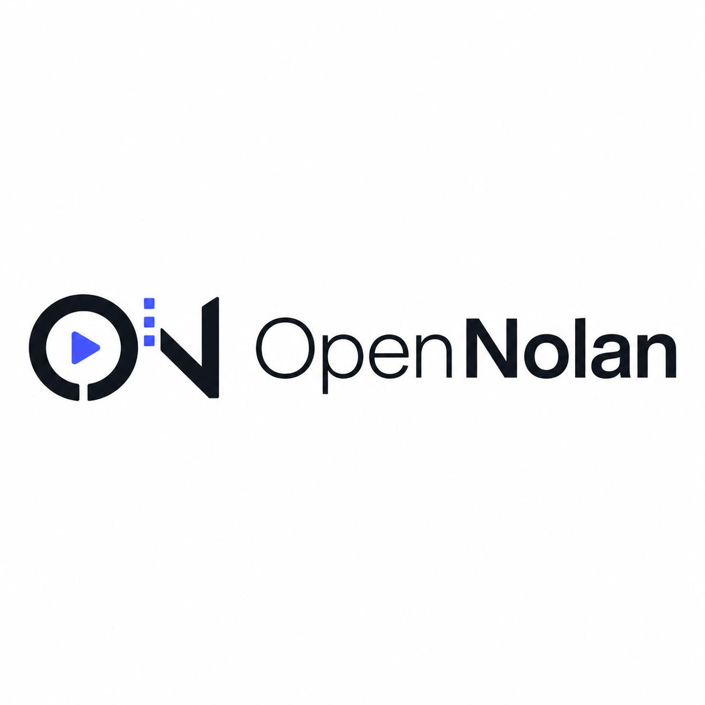

<p align="center">
  
</p>

<h1 align="center">OpenNolan</h1>

<p align="center"><strong>Open-source engine for generating fully-edited Instagram Reels &amp; TikToks — built to stop the scroll and drive engagement.</strong></p>

<p align="center">
  <a href="#what-it-makes">What It Makes</a> &nbsp;·&nbsp;
  <a href="#quick-start">Quick Start</a> &nbsp;·&nbsp;
  <a href="#use-it--two-ways">Web App</a> &nbsp;·&nbsp;
  <a href="#the-editing-engine">Editing Engine</a> &nbsp;·&nbsp;
  <a href="#captions--audio">Captions &amp; Audio</a> &nbsp;·&nbsp;
  <a href="#visual-styles">Styles</a> &nbsp;·&nbsp;
  <a href="#pipelines">Pipelines</a> &nbsp;·&nbsp;
  <a href="#how-it-works">How It Works</a>
</p>

<p align="center">
  <a href="LICENSE"></a>
  <a href="#quick-start"></a>
  <a href="#pipelines"></a>
</p>

---

Tell it the short-form video you want. OpenNolan's AI agent researches the hook, writes and voices the script, finds or generates the footage, **cuts it to the beat, burns in word-level captions, layers motion graphics and SFX, color-grades, and renders a finished 9:16 vertical reel** — ready to post to Instagram Reels, TikTok, or YouTube Shorts.

This is not a single-clip prompt toy. OpenNolan runs the **entire short-form editing pipeline** — the same sequence a creator grinds through by hand in CapCut or Instagram Edits — automated end to end. Use it two ways: open the **web app** (Mission Control) and work in a visual editor, or drive it from your **AI coding assistant** in plain language.

<div align="center">
  <video src="https://github.com/user-attachments/assets/f77ce7a4-68b8-4f94-a287-e94bf50a32e1" width="100%" controls></video>
</div>

---

## What It Makes

Scroll-stopping vertical video designed for the algorithm:

- **Hook-first reels** — the first 3 seconds are engineered to retain, because retention is the whole game on Reels and TikTok.
- **Word-level kinetic captions** — the karaoke-style burned-in captions that short-form viewers expect, synced tightly to the voiceover.
- **Beat-synced cuts** — footage cut on the music's rhythm so the edit *feels* alive.
- **Motion graphics & overlays** — animated text cards, stickers, callouts, and PiP layers that keep the frame busy and watchable.
- **Clean vertical framing** — automatic 9:16 reframing that keeps the subject centered, no matter the source aspect ratio.
- **Finished, postable output** — voiceover, music, SFX, captions, and color, all mixed and rendered into one file.

Bring a topic, a script, a reference reel you love, or raw footage — and get back a complete edit.

## Quick Start

### Prerequisites

- **Python 3.10+** — [python.org](https://www.python.org/downloads/)
- **FFmpeg** — `brew install ffmpeg` / `sudo apt install ffmpeg` / [ffmpeg.org](https://ffmpeg.org/download.html)
- **Node.js 18+** — [nodejs.org](https://nodejs.org/)
- *(Optional)* **An AI coding assistant** — Claude Code, Cursor, Copilot, Windsurf, or Codex — to drive it by chat

### Install

```bash
git clone https://github.com/het8802/OpenNolan.git
cd OpenNolan
make setup
```

> **No `make`?** Run manually: `pip install -r requirements.txt && cd remotion-composer && npm install && cd .. && pip install piper-tts && cp .env.example .env`
>
> **Windows:** If `npm install` fails with `ERR_INVALID_ARG_TYPE`, use `npx --yes npm install` instead.

### Use It — Two Ways

#### 1. The web app (Mission Control) — the main way in

Start the app with one command:

```bash
./run-dev
```

Then open **http://localhost:5173**. This boots both servers — the FastAPI backend on `:8000` and the React/Vite frontend on `:5173` — and gives you the full studio in your browser:

- **Create a project** and pick a pipeline (Reels studio, clip factory, podcast repurpose, …).
- **Upload your clips** and assets, or start from a topic or a reference reel.
- **Watch the edit build** stage by stage, approving each creative decision as it goes.
- **Fine-tune in the visual editor** — a timeline with keyframes, an overlay/motion inspector, and a live scrub + render preview, so you can hand-adjust anything before export.
- **Chat with the agent** in a side panel to direct the edit in plain language.

```bash
./run-dev --backend     # backend only (:8000)
./run-dev --frontend    # frontend only (:5173)
```

> The in-app **chat panel** uses the Claude Agent SDK. To enable it, run `claude setup-token` and set `CLAUDE_CODE_OAUTH_TOKEN` (or set `ANTHROPIC_API_KEY`). Everything else in the UI — projects, pipelines, uploads, the visual editor, and rendering — works without it.

#### 2. From your AI coding assistant

Prefer to stay in your editor? Open the repo in Claude Code, Cursor, Copilot, Windsurf, or Codex and just tell it what you want:

```text
"Make a 30-second Instagram Reel on '3 AI tools that save founders 10 hours a week.'
Punchy hook, kinetic captions, beat-synced cuts, trending-style energy."
```

Or start from a reel you admire:

```text
"Here's a TikTok I love: <url>. Analyze why it works, then make me 3 original
variants for my own product."
```

Either way, the agent researches the topic with live web search, writes and narrates the script with voice direction, finds royalty-free music automatically, cuts to the beat, burns in word-level captions, and renders the final vertical video. Before you see anything, it runs a multi-point self-review — ffprobe validation, frame sampling, audio-level analysis, and caption checks.

### Works With Zero API Keys

You don't need paid keys to make real reels. Out of the box, `make setup` gives you free stock footage, local text-to-speech, FFmpeg editing and composition, beat-synced cutting, and burned-in captions — enough to produce a complete vertical edit for free. Add keys later to unlock premium voices, AI footage, full-song music, and more (see [Providers](#providers)).

## The Editing Engine

The heart of OpenNolan is a real editing toolset — the moves that turn raw clips into a reel that holds attention.

**Cut & pace**
- **Beat-synced cutting** — detect the music's beats and align cuts to them.
- **Silence trimming** — strip dead air from talking-head footage automatically.
- **Scene detection** — find natural cut points in long source clips.

**Motion & energy**
- **Motion ops** — freeze frames, reverse, speed ramps, volume automation, and anti-jitter pan/zoom (Ken Burns) baked into real footage.
- **Keyframed overlays** — animate position, scale, and opacity with easing for text, logos, and graphics.
- **Per-cut transitions** — fade, wipe, slide, circle, and zoom transitions between cuts.

**Subject & compositing**
- **Auto-reframe** — face/subject-aware reframing to clean 9:16 vertical from any source aspect.
- **Object cutout (SAM2)** — isolate a subject for cutout effects and layered compositing.
- **Background removal & green-screen** — drop subjects onto new backgrounds.
- **Region masks** — blur, reveal, or restyle just part of the frame.

**Look & reuse**
- **AI restyle** — restyle footage into a new visual treatment.
- **Color grading** — apply graded looks for a consistent, premium feel.
- **Upscaling & face enhance** — clean up low-res or soft source footage.
- **Reusable templates** — save an edit recipe and apply it to future reels for a consistent channel look.

## Captions & Audio

Short-form lives and dies on captions and sound.

- **Word-level captions** — auto-transcribe the voiceover and burn in tightly-synced, animated captions in the kinetic/karaoke style viewers expect.
- **Voiceover** — generate narration across multiple TTS providers (premium and free/local), with voice effects and direction.
- **Music** — full songs and instrumentals, free royalty-free libraries, or generated tracks — matched to the reel's mood and length.
- **Curated SFX library** — 20+ reusable whooshes, impacts, UI hits, and emphasis sounds, placed at the right beats.
- **Mixing & ducking** — voiceover, music, and SFX automatically balanced so narration always sits on top.
- **Stickers & text cards** — animated GIPHY/Tenor stickers and styled text overlays for that native short-form feel.

## Visual Styles

Pick a look, and the whole reel inherits its typography, color, motion, and caption treatment. Style playbooks include:

| Playbook | Best for |
|----------|----------|
| `kinetic-whiteboard-captions` | Word-synced faceless explainers with floating UI cards |
| `flat-motion-graphics` | Punchy social motion-graphics for TikTok and Reels |
| `founder_clean_reel` | Clean talking-head founder reels with editorial captions |
| `talking-head-screen-demo-reel` | Creator-led product reels: warm A-roll + real screen proof + large PiP |
| `greg-isenberg-product-explainer` | Warm editorial product reels with proof receipts and workflow diagrams |
| `anthropic-editorial-animated` | Premium ivory/clay editorial motion for explainer reels |
| `pixel-rpg-product-explainer` | Game-map metaphor explainers in a pixel/quest visual language |

Don't see your look? Styles are plain YAML — add your own.

## Pipelines

OpenNolan ships a dedicated short-form studio, plus repurposing and creator pipelines:

| Pipeline | Best for |
|----------|----------|
| **`instagram-reels-studio`** | **The flagship: a brief or raw clips → a finished vertical reel using the full editing toolset (cutouts, keyframe motion, beat-synced cuts, motion ops, restyle, voiceover, SFX, stickers, text cards, masks, templates).** |
| `clip-factory` | Many short clips cut from one long source video |
| `podcast-repurpose` | Podcast highlights turned into shareable shorts |
| `talking-head-screen-demo-reel` | Creator reels with warm talking head + real product/screen proof |
| `animation-talking-head-50-50` | Split-screen: talking head + animated explainer panels |
| `documentary-montage` | Real-footage montages with music and elegiac pacing |
| `cinematic` | Trailer, teaser, and mood-led edits |

Run `make demo` to render zero-key demo videos instantly, or see the [Prompt Gallery](PROMPT_GALLERY.md) for tested prompts with expected costs.

## How It Works

OpenNolan uses an **agent-first architecture**. There is no rigid code orchestrator — your AI coding assistant *is* the director. It reads the instructions in this repo and drives the production:

```
Agent reads a pipeline manifest (YAML)
  → reads the stage director skill (Markdown) for HOW to do each step
  → uses tools (research, footage, voice, music, editing, captions, render)
  → self-reviews against quality gates
  → checks in with you at each creative decision
  → renders the final reel
```

Every production moves through stages — **research → script → scene plan → assets → edit → compose** — and the **edit stage is where the magic happens**: it orchestrates the editing engine onto a concrete edit plan (beat-aligned cuts, keyframed overlays, transitions, caption and audio decisions).

Three render runtimes are available so the agent can pick the right tool for the look:

| Runtime | Best for |
|---------|----------|
| **FFmpeg** | Footage-led editing: cuts, beat-sync, transitions, overlays, PiP, reframing, caption burn |
| **Remotion** | React-composed motion graphics, animated cards, charts, word-level caption animation |
| **HyperFrames** | HTML/CSS/GSAP composition: kinetic typography, product promos, launch reels |

## Smart Utilities

Beyond the edit, OpenNolan ships analysis tools that make reels better:

- **Engagement signal** — an advisory virality scorer that rates a short-form cut before you post (never blocks you — just a second opinion).
- **Face tracking & audio energy** — drive reframing and beat-sync from real signal in the footage.
- **Composition QA** — automated checks on framing, levels, captions, and delivery before render.
- **Reference analysis** — paste a reel you love and get a grounded breakdown of why it works, then original variants.

## Providers

Every key is optional — add what you have, and OpenNolan auto-discovers what's available. With **zero keys** you still get free stock footage, local TTS, and full FFmpeg editing.

```bash
# .env — all optional

FAL_KEY=your-key               # FLUX images + Google Veo, Kling, MiniMax video
PEXELS_API_KEY=your-key        # Free stock footage and images
PIXABAY_API_KEY=your-key       # Free stock footage, images, and music
SUNO_API_KEY=your-key          # Full songs and instrumentals, any genre
ELEVENLABS_API_KEY=your-key    # Premium TTS, AI music, sound effects
OPENAI_API_KEY=your-key        # OpenAI TTS, DALL-E 3 images
GOOGLE_API_KEY=your-key        # Google Imagen images, Google TTS (700+ voices)
RUNWAY_API_KEY=your-key        # Runway Gen-4 video
HEYGEN_API_KEY=your-key        # VEO, Sora, Runway, Kling via single gateway
```

<details>
<summary><strong>Have a GPU? Unlock free local video generation</strong></summary>

```bash
make install-gpu

# Then add to .env:
VIDEO_GEN_LOCAL_ENABLED=true
VIDEO_GEN_LOCAL_MODEL=wan2.1-1.3b  # or wan2.1-14b, hunyuan-1.5, ltx2-local, cogvideo-5b
```

</details>

## Output Profiles

Built for vertical-first platforms, with landscape and square available:

| Platform | Resolution | Aspect |
|----------|-----------|--------|
| Instagram Reels / TikTok / Shorts | 1080×1920 | 9:16 |
| Instagram Feed / Square | 1080×1080 | 1:1 |
| YouTube Landscape | 1920×1080 | 16:9 |
| YouTube 4K | 3840×2160 | 16:9 |

## Quality Governance

Reels still need to be *good*. Before anything renders, OpenNolan self-reviews against quality gates — ffprobe validation, frame sampling, audio-level analysis, caption checks, and a delivery-promise verification. Provider selections are scored across multiple dimensions and recorded in an auditable decision log, and budget controls keep paid generation in check. You approve every creative decision.

## Agent Compatibility

You don't need a coding assistant to use OpenNolan — the [web app](#1-the-web-app-mission-control--the-main-way-in) is the main way in. But if you'd rather drive it from your editor, OpenNolan works with any AI coding assistant that can read files and run Python. Dedicated instruction files are included for Claude Code, Cursor, Copilot, Windsurf, and Codex. Start with [`AGENT_GUIDE.md`](AGENT_GUIDE.md), then [`PROJECT_CONTEXT.md`](PROJECT_CONTEXT.md).

## Contributing

OpenNolan is built to be extended — new editing tools, pipelines, and style playbooks are all welcome. The two most common contributions:

- **Add a tool** — subclass `BaseTool`, declare its capability, and it's auto-discovered by the registry and selectors.
- **Add a pipeline** — drop a manifest in `pipeline_defs/` plus stage director skills in `skills/pipelines/`.

```bash
make test-contracts   # contract tests, no API keys needed
make test             # full suite
```

## License & Attribution

OpenNolan is **free software**, licensed under the [GNU AGPLv3](LICENSE). It is a fork of [OpenMontage](https://github.com/calesthio/OpenMontage) by **calesthio**, who authored the original project. OpenNolan preserves that authorship and builds on top of it.

- Original work — OpenMontage: Copyright (C) 2026 calesthio
- OpenNolan: Copyright (C) 2026 Het Tikawala

See [NOTICE](NOTICE) for full attribution and third-party components. The entire combined work remains under AGPL-3.0.

---

**OpenNolan** — open-source, agent-driven Reels &amp; TikTok production. If it looks useful, a ⭐ helps others find it.
